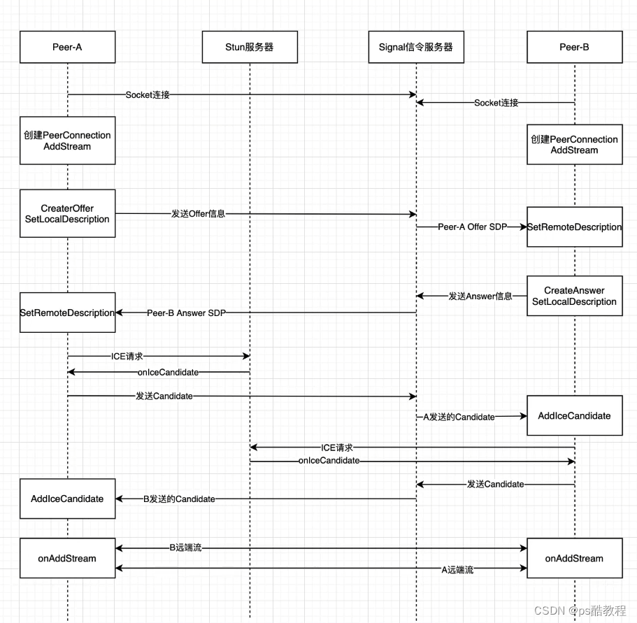
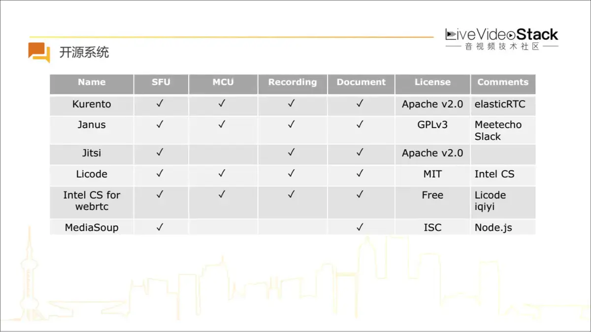
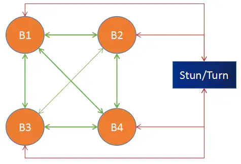
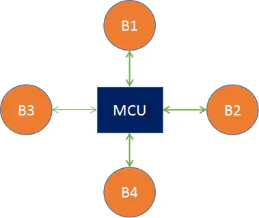
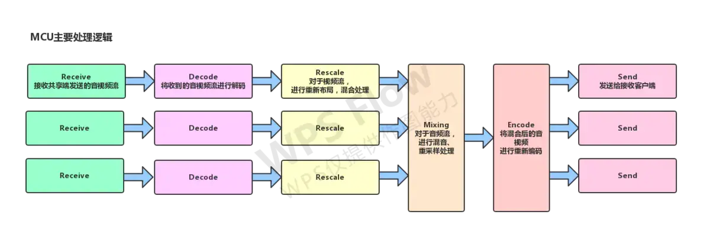
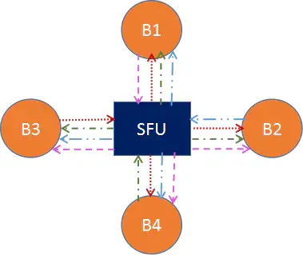
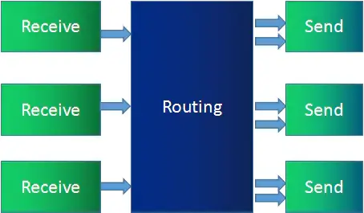

# 基于Pion的golang 音视频开发

    https://github.com/pion 一个开源的用golang编写的即时音视频库 webrtc
    webrtc （Web Real-Time Communication）的缩写，网页即时通信，是一种支持网页浏览器进行实时语音通话或者视频聊天的技术，是谷歌收购的一项技术
    
  [web相关的描述信息可以在](https://developer.mozilla.org/zh-CN/docs/Web/API/WebRTC_API)
    
    sip (Session initialization Protocol) 是一个应用层的信令控制协议。用于创建、修改和释放一个或多个参与者的会话。这些会话可以是Internet多媒体会议、IP电话或多媒体分发。会话的参与者可以通过组播（multicast）、网状单播（unicast）或两者的混合体进行通信。

webrtc p2p 流程(很重要的一个图！！！) 

    SDP（Session Description Protocol 会话描述协议）是一个描述 P2P 连接的标准，包含音视频的编解码器、源地址和时间信息。
        SDP由一行或者多行UTF-8文本组成，每一行以一个字符的类型开头，后跟等号(=)，然后是包含值或描述的结构化文本，其格式取决于类型。
        里面的关键参数有
        UDP TCP TLS 编解码器 分辨率 帧率 比特率
        里面的重要板块有
        媒体信息：以m开头的， rtpmap ssrc媒体流的唯一标识
        网络描述：以a开头的
        安全描述：以a开头的 ice开始的、fingerprint、setup
        服务质量：以a开头的

    ICE(Interactive Connectivity Establishment 交互式连接建立协议)，具体过程为:收集Candidate、交换Candidate、按优先级尝试连接

        ICE是一种框架，整合了STUN和TURN两种协议，可以用开源的cotrun来搭建STUN/TURN服务器，也可以使用golang开发的 pion/turn
        
        信令服务器：一般是websocket服务器 在通信的双方建立连接前，交换必要的信息，比如网络信息、媒体参数等，交换SDP，交换Candidate；
                同时还可以作一些扩展功能，IM功能，如房间管理，用户管理(用户列表、用户进入、用户退出、呼叫、挂断等)
        
        STUN服务器：NAT 会话穿越应用程序）是一个用于绕过 NAT（网络地址转换器）传递数据的辅助协议。STUN 会返回一台位于 NAT 背后的已接入网络的计算机的 IP 地址、端口和连通状态
        TURN服务器：使用中继器穿透 NAT）是一个能够让位于网络地址转换（NAT）或者防火墙之后的主机接受和发送数据的协议。WebRTC 使用 TURN 允许互联网上的任何两台设备进入点对点连接。

    RTP 是一种协议，用于实时传输音频和视频数据
    RTCP 是RTP的伴随协议，用于控制数据传输和收集统计信息。
        SenderReport
        RecieverReport

## webrtc的理论基础知识建立，
    
 [结合亢少军的视频](https://www.bilibili.com/video/BV1q54y1X7aY/?spm_id_from=333.999.0.0&vd_source=d5fa5216fd2846a4da58ccfad53b6049)
 [以及椛茶的视频](https://www.bilibili.com/video/BV1Zz4y137Un/?spm_id_from=333.1007.top_right_bar_window_custom_collection.content.click&vd_source=d5fa5216fd2846a4da58ccfad53b6049)
    
    亢少军的文字型介绍很明朗，椛茶的用js来演示这些，理论+实践；相得益彰。
    
## webrtc 中重要的东西

### 三个重要的部分：

    MediaStream 媒体数据流，如音频流、视频流等
    RTCPeerConnection 提供了应用层的调用接口
    RTCDataChannel 非音视频数据通过它传输，如文字、图片等

### 重要的过程

    重要的媒体协商过程，就是通过信令服务器来交换 本地SDP 和 candidate。
    本地的调用SetLocalDescription()，会触发Onicecandidate事件，事件的处理就是将candidate发送给信令服务器，通过信令服务器来传给对端
    而通过信令服务器接收到candidate后会调用AddICECandidate()来加入远端候选者
    AddTrack()会触发远端pc的negotiationneeded，从而重新进行offer/answer的信息互换

    媒体流的sender和reciever是通过AddTrack()和OnTrack()来进行操作的

    SDP：信令服务器交换会话描述协议
    offer/answer SDP
    candidate ICE候选者（Interactive Connectivity Establishment Candidates）交互式连接建立候选人

    三个服务器：
        信令服务器：将接入的客户端(pc)的SDP交换出去
        STUN服务器：处于公网上，客户端(pc)通过它来确定自己的公网ip和端口
        TURN服务器：不仅用于发现客户端的公网IP地址和端口，还实际参与数据传输。
                    TURN服务器接收客户端的数据，并将其转发到目标客户端。
                    这种方式确保了即使在最复杂的NAT和防火墙环境中，WebRTC通信仍然可以进行

    信令服务器的基本作用：处理三种消息类型：Offer/Answer类型 candidate类型
    服务器接收到这三种类型消息后，按要求(或向指定对端发送，或向所连入的对端(除去发送端)广播)

    RTCPeerConnection的操作：
        ---CreateOffer() 本地生成自己的SDP
        ---SetLocalDescription() 设置自己的SDP，会触发 Onicecandidate的触发函数(此函数的实际内容一般为将本地的candidate封装成candidate类型的消息 发送给信令服务器)
        ---SetRemoteDescription() 设置自己的对端的SDP，一般是接收到信令服务器传来的Answer类型数据后，进行的，也会触发Onicecandidate
        ---AddICECandidate() 加入远端候选者，一般是接收到信令服务器传来的candidate类型数据后，进行的
                将新接收的候选者传递给ICE 代理，从而使其建立潜在连接列表
    
        ---Ontrack() 触发函数, 当RTCRtpReceiver收到新的媒体轨道时，触发该事件,一般是将对端的track加入到一个新建的MediaStream()，然后展示到html标签上 
                获取的变量结构体为 RTCTrackEvent 内容为：
                receiver   ：RTCRtpReceiver，用于接收轨道的媒体
                streams    ：MediaStream对象的数组，表示构成事件对应的轨道的流
                track      ：MediaStreamTrack，与事件关联的
                transceiver：RTCRtpTransceiver，与事件关联的
            
        
                RTCRtpTransceiver代表双向流，包含一个 RTCRtpSender 和一个 RTCRtpReceiver
        ---AddtTrack() 向连接中添加新的媒体轨道,媒体轨道将被传输到对等端,也会引起对端pc的RTCRtpReceiver数组的变换;触发negotiationneeded事件，导致ICE重新协商
        ---RemoveTrack() 停止发送媒体数据；触发negotiationneeded事件，导致ICE重新协商
            ICE协商的过程就是，设置本地SDP 获取对端SDP，调用设置对端SDP

        ---AddTransceiver() 创建一个新的 RTCRtpTransceiver 并加入 RTCPeerConnection，RTCRtpTransceiver 代表一个双向流，包含一个 RTCRtpSender 和一个 RTCRtpReceiver。
        ---GetTransceiver() 获取 RTCRtpTransceiver 对象列表
        ---GetSenders() 获取 RTCRtpSender 对象列表
        ---GetReceivers() 获取 RTCRtpReceiver 对象列表

## webrtc_api

    webrtc+websocket作即时视频通话
    go pion做的信令服务器，
    //以pc=RTCPeerConnection()
    //signaler = ws() (websocket server)
    //说明交互过程
    pc与signaler之间的交互过程:
    1、服务端起好 websocket server,等待ws客户端接入
    2、pc端，获取多媒体，建立pc，
        设置好pc的ontrack回调，回调内容为：将接入的远端多媒体轨道接入到本地，比如 video标签；
        设置好pc的onicecandidate触发,触发内容为：将接收到的接收的候选者信息发送到signaler
        新建ws客户端，接入到服务器端
    3、signaler接收到客户端接入的信息后，
        新建一个与客户端pc交互的本地pc.
        调用本地pc的AddTransceiverFromKind将音轨和视频轨加入到交互pc，
        将交互pc加入到本地交互pc数组中
        添加交互pc的OnICECandidate回调，回调内容为：将接收到的候选者信息再回送给pc客户端
        将客户端信息存入本地数组，
        添加交互pc的OnConnectionStateChange回调，处理断开情况
        添加交互pc的OnTrack回调，回调内容为：将接收到的多媒体都广播到其他客户端
        处理接入的所有交互pc，向新加入的交互pc发送offer

    所以整个过错是：
    1、signaler 收到新接入的客户端，创建交互pc，
        设置交互pc的OnICECandidate。向客户端发送 candidate
        新建offer，设置本地SDP SetLocalDescription，向新接入的客户端发送offer
    2、pc客户端接收到offer后，将offer设置为远端SDP setRemoteDescription，
        新建answer，设置为本地SDP setLocalDescription，同时发送自己的answer到signaler
    3、singlaer接收到answer后，将客户端的answer内容设置为远端SDP SetRemoteDescription
    4、pc和signaler将自己的候选者信息发送给对方，同时在ws通道内接收到candidate后调用pc的addIceCandidate
    6、pc和signaler的交互pc 设置 ontrack
    
    总结一下：
    ws中客户端与服务器端的交互就是，客户端client 与服务器的接入peer进行，交换信息
    通过这个通道通过发送 offer answer candidate 类型的信息完成信息协商。
    ##很重要的事情
    当 RTCPeerConnection 通过 RTCPeerConnection.setLocalDescription() 方法更改本地描述之后，
    该 RTCPeerConnection 会抛出 icecandidate 事件。该事件的监听器需要将更改后的描述信息传送给远端 RTCPeerConnection，以更新远端的备选源。
    
    该事件会在pc初始化后调用添加本地SDP后，触发OnICECandidate的回调函数    

## webrtc的三种开源方案

    优缺点从以下方面看：
    带宽流量：上行/下行
    服务器:需不需要，服务器硬件消耗，代码复杂度
    客户端：硬件消耗，代码复杂度
    sfu是选型较多的
[知乎上webRTC三种方案的介绍](https://zhuanlan.zhihu.com/p/588026356)

较著名的开源方案图示

### mesh 点对点/网状

mesh图

    多个p2p点对点，一般不走中转服务器，优点：节省流量，省服务器；缺点：支持的人数少，因为客户端的编解码和带宽压力大
    小班教学、几个人开会    6个人以内的
    A ->B,->C,->D   3M;   B->A,C->A,D-A     3M
    B ->A,->C,->D   3M;   A->B,C->B,D-B     3M
    C ->A,->B,->D   3M;   A->C,B->C,D-C     3M
    D ->A,->B,->C   3M;   A->D,B->D,C-D     3M

### mcu 多点控制单元

mcu图

    人多的会议场景，需要服务器支撑，合成视频、混音,优点：支持的人多，流量小；缺点：服务器资源消耗大，需要较高的硬件配置，同时代码编写复杂
    A ->mcu 1M;  mcu->A 1M
    B ->mcu 1M;  mcu->B 1M
    C ->mcu 1M;  mcu->C 1M
    D ->mcu 1M;  mcu->D 1M

    抖音中连麦场景：
    A---WebRTC---B  --->MCU合成 ---->RTMP/CDN ---->(客户端)RTMP/HLS播放器
mcu代码实现逻辑

### sfu 选择性转发单元 

sfu图

    会议、教育、人比较多的场景，需要SFU服务器，只做转发，不作合成,优点：服务器压力小，不需要较高的硬件配置。代码复杂度中等;缺点：带宽要求高，流量大
    A ->sfu 1M； sfu-B-A sfu-C-A sfu-D-A 3M
    B ->sfu 1M； sfu-A-B sfu-C-B sfu-D-B 3M
    C ->sfu 1M； sfu-A-C sfu-B-C sfu-D-C 3M
    D ->sfu 1M； sfu-A-D sfu-B-D sfu-C-D 3M
sfu代码实现逻辑

## 项目代码

### RTSPtoWebRTC

    参考 https://github.com/deepch/RTSPtoWebRTC

### RTSPtoWeb
    
    参考 https://github.com/deepch/RTSPtoWeb

### meeting

    参考 https://github.com/GetcharZp/meeting.git

### webrtc-vue3

    参考亢少军的 h5的webrtc的代码，

    视频地址为 https://www.bilibili.com/video/BV1q54y1X7aY/?spm_id_from=333.999.0.0&vd_source=d5fa5216fd2846a4da58ccfad53b6049
            从这个视频开始，可以跟着亢神学习webrtc的基础理论，知道webrtc是怎么作的，才能从理论上指导我们，看各种代码写的webrtc，比如js、go、c++、java等。
            如果不是为了精通webrtc，只是为了使用，不建议用c++,因为高级语言的实现比较容易且能最快出效果。

    代码地址为 https://github.com/kangshaojun/webrtc-book h5-samples单元。 代码用的是webpack+react,需要改为vite+vue3
    学习的视频是 https://space.bilibili.com/394612055/channel/seriesdetail?sid=1193215&ctype=0

    以golang来学习webrtc的话，可以学习亢少军参与的 github.com/pion/ion的项目，技术框架为go+flutter
